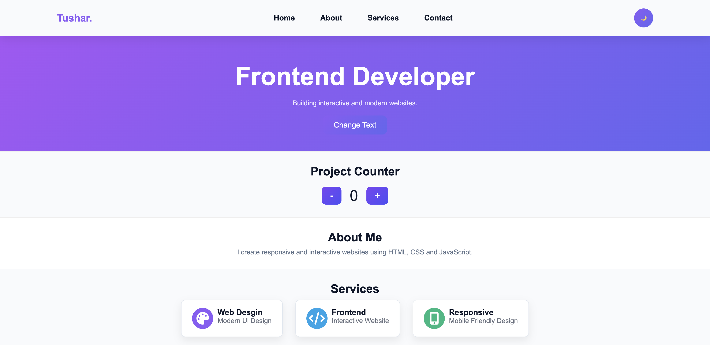
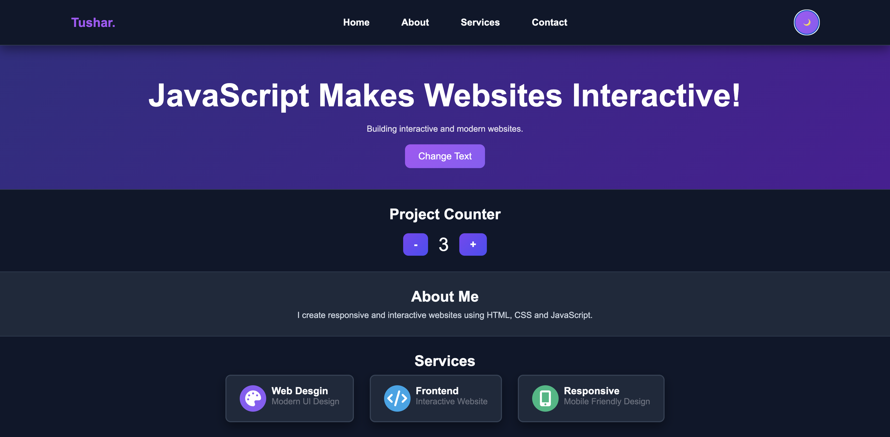

# Decordlabs-task-3-

# Interactive Portfolio Website

A modern and responsive portfolio website built using **HTML, CSS, and JavaScript**.  
This project showcases a clean UI with interactive features like dark mode, dynamic text change, project counter, and responsive design.

---

## Features

- Light Mode / Dark Mode Toggle
- Dynamic Hero Text Change
- Interactive Project Counter
- Fully Responsive Design
- Modern UI with Gradient Styling
- Contact Form Section

---

## Technologies Used

- HTML5
- CSS3
- JavaScript (Vanilla JS)
- Font Awesome Icons

---
## Screenshots

### Light Mode

### Dark Mode

---

## Author
Tushar

Frontend Developer passionate about building responsive and interactive websites.
